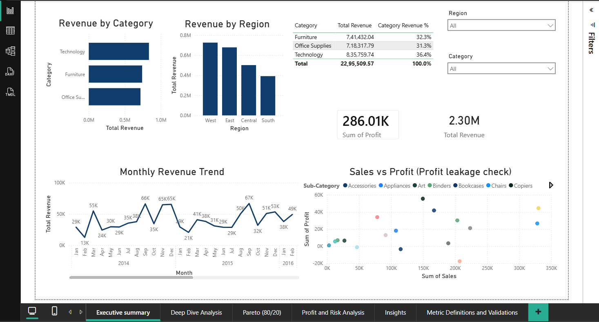
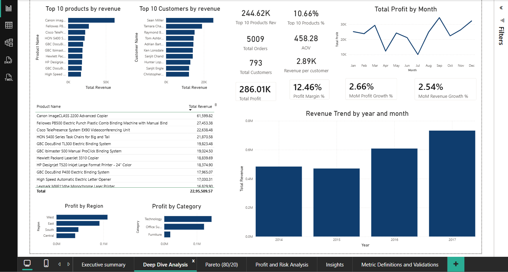
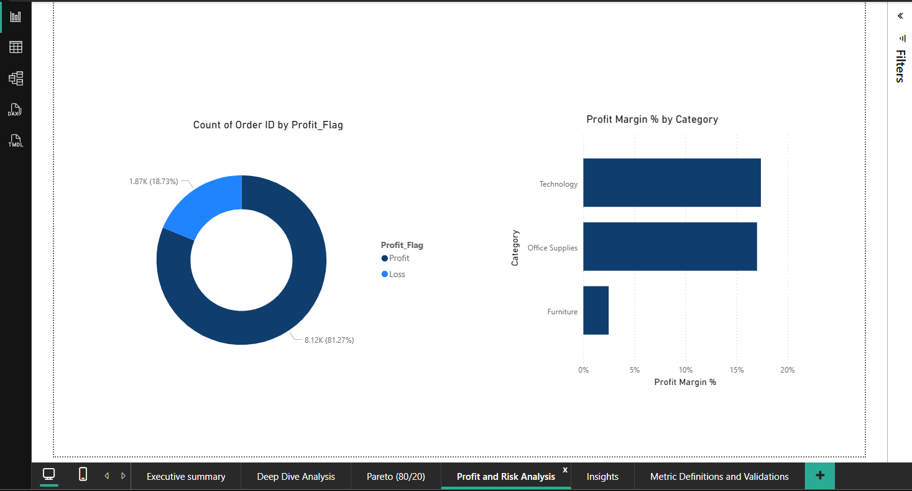
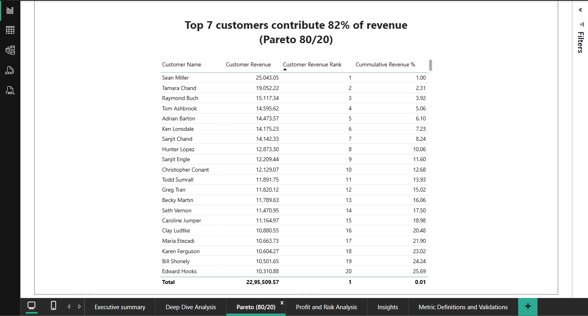
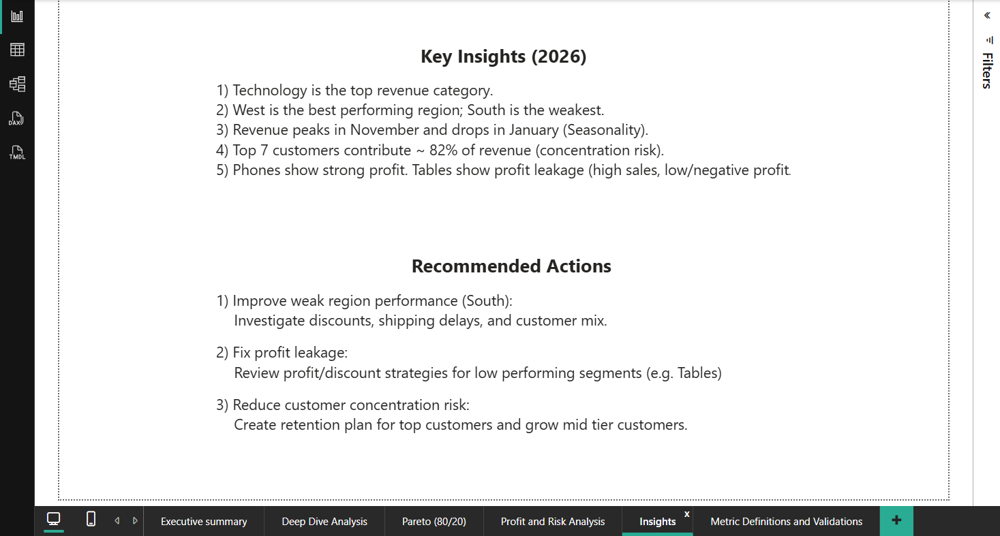
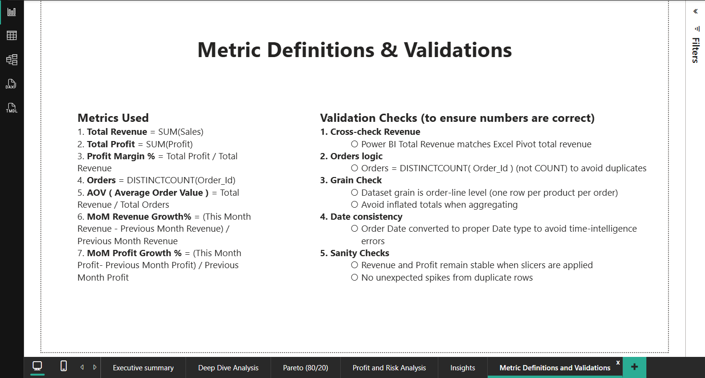

# Superstore Sales Performance Analysis

## Overview
This project analyzes retail sales data to identify revenue trends, profitability drivers, and customer concentration risks.  
The goal is to support data-driven business decisions through clean metrics, structured analysis, and executive-ready dashboards.

---

## Business Questions Answered
- How is revenue trending over time?
- Which categories and regions drive the most profit?
- Are we dependent on a small group of customers?
- Where do profitability risks exist?

---

## Tools Used
- **Power BI** – Interactive dashboards & KPI analysis
- **SQL** – Data aggregation, ranking, and time-series analysis
- **Excel** – Metric validation and cross-checking
- **GitHub** – Version control and documentation

---

## Dashboard Pages
1. **Executive Summary** – High-level KPIs and trends  
2. **Deep Dive Analysis** – Product, customer, and regional performance  
3. **Profit & Risk Analysis** – Profitability vs revenue comparison  
4. **Pareto (80/20) Analysis** – Customer revenue concentration  
5. **Insights & Recommendations** – Business actions  
6. **Metric Definitions & Validation** – Metric design and accuracy checks  

---

📄 Dashboard PDF available in `/dashboard`

## Dashboard Preview

### Executive Summary

### Deep Dive Analysis

### Profit & Risk Analysis

### Pareto Analysis

### Insights & Recommendations

### Metrics & Validation

---

## Key Insights
- Top 7 customers contribute ~82% of total revenue → **concentration risk**
- Technology category is the highest revenue contributor
- Significant seasonality observed with revenue peaks in Q4
- Some segments generate high revenue but low profit

---

## Repository Structure
- dashboard/ → Final Power BI dashboard (PDF)
- sql/ → Interview-grade SQL queries
- metrics/ → Metric definitions & validation
- documentation/ → Project notes and decisions

---

## Why This Project Matters
This project focuses not just on visualization, but on:
- Correct data grain
- Reliable metric design
- Validation against inflated numbers
- Translating analysis into business decisions

